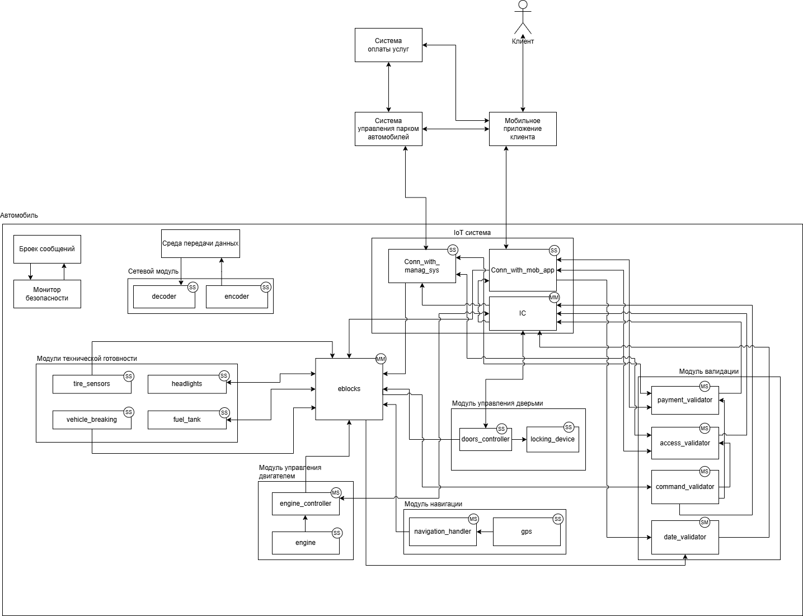
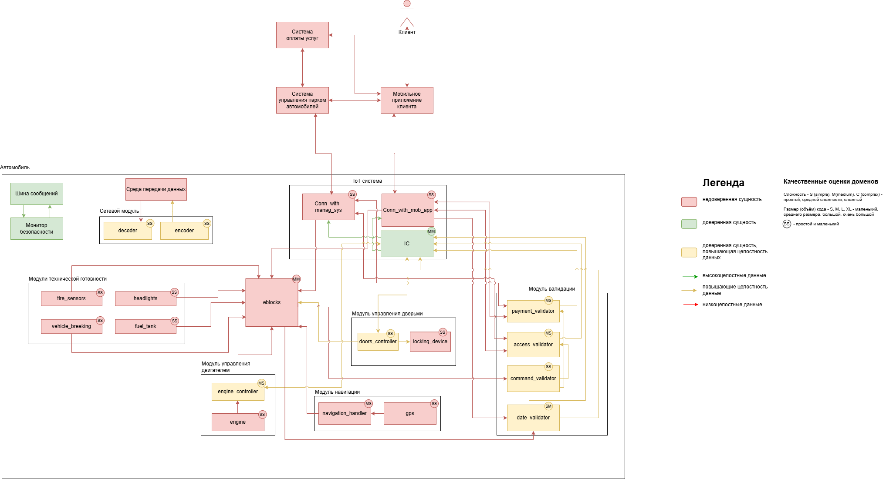

## Структура проекта
[Общая структура](#общая-структура)\
[Система управления парком автомобилей](#система-управления-парком-автомобилей)\
[Система оплаты услуг](#система-оплаты-услуг)\
[Автомобиль](#автомобиль)\
[Мобильное приложение клиента](#мобильное-приложение-клиента)

### Общая структура

project/
│── module/ **Название модуля** \
│ │── config/ **Содержит файл с зависимостями которые используются в проекте**\
│ └── requirements.txt\
│ │── data/ **Данные используемые в модуле, наличие по необходимости (может быть instance, в случае использования БД)** \
│ │ └── data.json\
│ │── src/ **Основной код модуля**\
│ │ ├── \_\_init\_\_.py **Инициализация приложения (стандартный для всех модулей)** \
│ │ └── main.py **Код приложения** \
│ │── Dockerfile **Сборка образа (стандартный для всех модулей, по необходимости вносяться изменения)** \
└─── start.py **Запуск модуля**

Перед запуском настроить среду для разработки:

```make dev_install```

Пример запуска:

```python3 module/start.py```

Важно! При локальном запуске (не в Docker образе) заменить URL на localhost и так же порт

Пример:

```MANAGMENT_URL = 'http://management_system:8000'``` на ```MANAGMENT_URL = 'http://0.0.0.0:8001'```

### Система управления парком автомобилей

#### cars

Программный имитатор управления парком автомобилей, содержит простую базу данных для хранения данных клиента

### API

#### URL http://0.0.0.0:8003

|Название метода|Тип запроса|Входные параметры|Ответ (успешный)|Описание|
|:--|:--|:--|:--|:--|
|/cars|GET||list[string]|Опрашивает доступные автомобили и отдаёт список свободных автомобилей|
|/tariff|GET||list[string]|Отдает список тарифов|
|/telemetry/<string:brand>|POST|Имя автомобиля||Функция для получения телеметрии от автомобилей во время поездки|
|/access/<string:name>|POST|Имя клиента|{'access': bool, 'tariff': string, 'car': string}| Проверка доступа клиента до автомобиля|
|/confirm_prepayment/<string:name>|POST|Имя клиента||Фукнция получения потверждений об оплате предоплаты клиента от системы оплаты услуг|
|/confirm_payment/<string:name>|POST|Имя клиента|{'car': string, 'name': string, 'final_amount': int,'created_at': time, 'elapsed_time': int, 'tarif': string}|Фукнция получения потверждений об оплате поездки клиента от системы оплаты услуг, формирует финальный чек о поездке и передаёт клиенту|
|/select/car/<string:brand>|POST|{'client_name': string, 'experience': int, 'tariff': string}|{'id': int, 'amount': int, 'client_id': int, 'status': string}|Бронирование и рассчет предоплаты в зависимости от функций автомобиля|
|/return/<string:name>|POST|Имя клиента|{'id': int, 'amount': int, 'status': string, 'client_id': int}|Рассчёт стоимости всей поездки в зависимости от опыта и тарифа, создание оплаты. Получает запрос от автомобиля|

### Система оплаты услуг

#### payment-system

Программный имитатор банковской системы, содержит базу данных для сохранения операций клиента

### API

#### URL http://0.0.0.0:8000

|Название метода|Тип запроса|Входные параметры|Ответ (успешный)|Описание|
|:--|:--|:--|:--|:--|
|/clients|POST|{"name": string}|{'id': int, 'name': string}|Создает или отдаёт клиента если он существует в базе системы оплаты услуг|
|/clients/<int:client_id>|GET|int|{'id': int, 'name': string}|Получение по ИД (системы оплаты услуг) клиента|
|/clients/<int:client_id>/invoices|GET|int|[{'id': int, 'amount': int, 'status': string}]|Получение всех неоплаченных счётов клиента|
|/invoices|POST|{'client_id': int, 'amount': int}|{'id': int, 'amount': int, 'status': string, 'client_id': int}|Создание оплаты для клиента|
|/invoices/<int:invoice_id>|GET|int|{'id': int, 'amount': int, 'status': string, 'client_id': int}|Получение статуса оплаты по ИД|
|/invoices/<int:invoice_id>/confirm|POST|int|{'id': int, 'status': string, 'final_receipt': {'car': string, 'name': string, 'final_amount': int,'created_at': time, 'elapsed_time': int, 'tarif': string}}|Оплата счёта по ИД и получение финального чека от системы управления парком автомобилей|
|/invoices/<int:invoice_id>/receipt|GET|int|{'id': int, 'amount': int, 'status': string, 'created_at': time,'client_id': id}|Формирование чека от системы оплаты услугу, архивирование оплаты|
|/clients/<int:client_id>/archived_invoices|GET|||Получение архива платежей по ИД клиента (не используется)|
|/clients/<int:client_id>/prepayment|POST|{'amount':int}|{'id': int, 'amount': int, 'client_id': int, 'status': string}|Создание счёта предоплаты|
|/prepayment/<int:prepayment_id>/confirm|POST|int|{'id': int, 'status': string}|Оплата счёта предоплаты|
|/clients/<int:client_id>/prepayments|GET|int|[{'id': int, 'amount': int, 'status': string}]|Получение всех предоплат по ID клиента|

### Автомобиль

#### cars
Программный имитатор автомобилей, эмулирует поезду и взаимодействие с автомобилем\
Доступно добавление автомобилей путем добавления записи в файл **cars.json** по аналогии с записями в файле

### API

#### URL http://0.0.0.0:8001

|Название метода|Тип запроса|Входные параметры|Ответ (успешный)|Описание|
|:--|:--|:--|:--|:--|
|/car/status/all|GET||[{"brand": string,"is_running": bool,"speed": int,"coordinates": (int, int), "occupied_by": string, "trip_time": int, "has_air_conditioner": bool, "has_heater": bool, "has_navigator": bool, "tariff ": string}]|Возвращает все статусы автомобилей|
|/car/start/<string:brand>|POST|Имя автомобиля|string|Запуск автомобиля|
|/car/stop/<string:brand>|POST|Имя автомобиля|string|Остановка автомобиля|
|/car/status/<string:brand>|GET|Имя автомобиля|{"brand": string,"is_running": bool,"speed": int,"coordinates": (int, int), "occupied_by": string, "trip_time": int, "has_air_conditioner": bool, "has_heater": bool, "has_navigator": bool, "tariff ": string}|Получени статуса автомобиля|
|/car/occupy/<string:person>|POST|Имя клиента|string|Арендовать автомобиль|

### Мобильное приложение клиента

#### mobile-client

Программный имитатор мобильного приложения отвечающего за связь со всеми системами

### API 

#### URL http://0.0.0.0:8002

### Описание Сценариев (последовательности выполнения операций), при которых ЦБ нарушаются

Нарушение ЦБ (Целей безопасности) в базовом решении

Напоминание ЦБ:

1. При любых обстоятельствах поездки осуществляются только авторизованными клиентами
2. При любых обстоятельствах используются только авторизованные услуги
3. При любых обстоятельствах клиентами используются только авторизованные команды
4. При любых обстоятельствах поездки осуществляются с соблюдением скоростных ограничений
5. При любых обстоятельствах поездки осуществляются только в пределах авторизованных районов оказания услуг

|Атакованный компонент|ЦБ1|ЦБ2|ЦБ3|ЦБ4|ЦБ5|Кол-во нарушений|
|:--|:-:|:-:|:-:|:-:|:-:|:-:|
|IoT Система|🔴|🔴|🔴|🔴|🔴|5/5|
|Модуль технической готовности|🟢|🟢|🟢|🟢|🟢|0/5|
|Модуль управления двигателем|🟢|🔴|🔴|🔴|🟢|3/5|
|Модуль навигации|🟢|🟢|🟢|🟢|🔴|1/5|
|Модуль управления дверьми|🟢|🟢|🔴|🟢|🟢|1/5|
|Электронные блоки системы|🟢|🔴|🔴|🔴|🔴|4/5|


🟢 - ЦБ не нарушена 🔴 - ЦБ нарушена

|Название сценария|Описание|
|---|----------------------|
|НС-1|Модуль управления автомобилем был скомпроментирован и не реагировал на нарушения скоростного режима и пределов авторизированного района, что нарушает ЦБ 4, 5|

**Негативный сценарий - НС-1:**


## Переработанная архитектура



### Таблица новых компонентов

|Компонент|Описание|Комментарий|
|:---|:--|:--|
|4. Контроль поездки|Проверяет скоростные и районные ограничения для поездки|В случае не соблюдения требований 3 раза подряд, принудительно завершает поездку клиента|
|6. Верификация команд и услуг|Проверяет разрешенные команды и услуги запрашиваемые к исполнению|В случае если команда или услуга не проходит проверку, то пропускает их|
|7. Авторизация клиента|Создание и проверка токена клиента|Авторизации клиента в системе|
|8. Приём данных от автомобиля|Получает данные от автомобиля||
|9. Отправка данных в автомобиль|Отправляет данные в автомобиль|Передача происходит по защищенном каналу связи|

### Диаграмма последовательности

#### Выполнение базового сценария


## Указание "доверенных компонент" на архитектурной диаграмме



#### Таблица доверенных компонентов

|Компонент|Уровень доверия|Обоснование|Комментарий|
|:--|:--|:--|:--|
|1. Связь с мобильным клиентом|$\textcolor{red}{\textsf{Недоверенный}}$|||
|2. Профиль клиента|$\textcolor{red}{\textsf{Недоверенный}}$|||
|3. Управление поездкой|$\textcolor{red}{\textsf{Недоверенный}}$|||
|4. Контроль поездки|$\textcolor{orange}{\textsf{Доверенный}}$|Соблюдение ЦБ 2, 3||
|5. Работа с системой оплаты услуг и счетами|$\textcolor{red}{\textsf{Недоверенный}}$|||
|6. Верификация команд и услуг|$\textcolor{orange}{\textsf{Доверенный}}$|Соблюдение ЦБ 4, 5||
|7. Авторизация клиента|$\textcolor{green}{\textsf{Доверенный}}$|Соблюдение ЦБ 1||
|8. Приём данных от автомобиля|$\textcolor{red}{\textsf{Недоверенный}}$|||
|9. Отправка данных в автомобиль|$\textcolor{green}{\textsf{Доверенный}}$|Соблюдение ЦБ 1, 2, 3, 4, 5||

#### Качественная оценка доменов

|Компонент|Уровень доверия|Оценка|Кол-во входящих интерфейсов|Комментарий|
|:--|:-:|:-:|:-:|:--|
|1. Связь с мобильным клиентом|$\textcolor{red}{\textsf{Недоверенный}}$|ML|2||
|2. Профиль клиента|$\textcolor{red}{\textsf{Недоверенный}}$|CL|3||
|3. Управление поездкой|$\textcolor{red}{\textsf{Недоверенный}}$|CL|2||
|4. Контроль поездки|$\textcolor{orange}{\textsf{Доверенный}}$|SL|1||
|5. Работа с системой оплаты услуг и счетами|$\textcolor{red}{\textsf{Недоверенный}}$|CL|2||
|6. Верификация команд и услуг|$\textcolor{orange}{\textsf{Доверенный}}$|SM|1|Проверка команд по whitelist|
|7. Авторизация клиента|$\textcolor{green}{\textsf{Доверенный}}$|SS|1|Создание уникальных токенов клиента и сверка его с последующими запросами|
|8. Приём данных от автомобиля|$\textcolor{red}{\textsf{Недоверенный}}$|MM|1||
|9. Отправка данных в автомобиль|$\textcolor{green}{\textsf{Доверенный}}$|SL|2|Отправка данных или команд по защищенному каналу связи|

### Проверка негативных сценариев

|Название сценария|Описание|
|---|---------|
|НС-1|Тест Негативного сценария 1. Модуль управления автомобилем скомпроментирован, но так как ввёден модуль контроля поездки и он отслеживает скоростной режим и границы авторизированного района и в случае нарушения завершает поездку (завершение поездки не нарушает ЦБ), ЦБ не нарушаются|

**Негативный сценарий - НС-1:**


|Компонент|Соответствие|
|-----|-----|
|1. Связь с мобильным клиентом|com-mobile|
|2. Профиль клиента|profile-client|
|3. Управление поездкой|manage-drive|
|4. Контроль поездки|control-drive|
|5. Работа с системой оплаты услуг и счетами|bank-pay|
|6. Верификация команд и услуг|verify|
|7. Авторизация клиента|auth|
|8. Приём данных от автомобиля|receiver-car|
|9. Отправка данных в автомобиль|sender-car|
|Автомобиль|cars|
|Система оплаты услуг|payment-system|
|Мобильное приложение клиента|mobile-client|

### Политики безопасности

```python {lineNo:true}
policies = (
    {"src": "com-mobile", "dst": "profile-client"},
    {"src": "profile-client", "dst": "com-mobile"},
    {"src": "profile-client", "dst": "manage-drive"},
    {"src": "profile-client", "dst": "bank-pay"},
    {"src": "manage-drive", "dst": "profile-client"},
    {"src": "bank-pay", "dst": "profile-client"},
    {"src": "manage-drive", "dst": "verify"},
    {"src": "verify", "dst": "auth"},
    {"src": "auth", "dst": "sender-car"},
    {"src": "receiver-car", "dst": "control-drive"},
    {"src": "control-drive", "dst": "sender-car"},
    {"src": "control-drive", "dst": "manage-drive"}
)


def check_operation(id, details) -> bool:
    """ Проверка возможности совершения обращения. """
    src: str = details.get("source")
    dst: str = details.get("deliver_to")

    if not all((src, dst)):
        return False

    print(f"[info] checking policies for event {id}, {src}->{dst}")

    return {"src": src, "dst": dst} in policies

```

## Запуск приложения и тестов

### Запуск приложения

см. [инструкцию по запуску](../README.md)

### Запуск тестов

_Предполагается, что в ходе подготовки рабочего места все системные пакеты были установлены._

Запуск примера: открыть окно терминала в Visual Studio code, в папке с исходным кодом выполнить

**make all**

запуск функционального теста (e2e):

**make test**

запуск тестов политик безопасности:

**make test_security**
